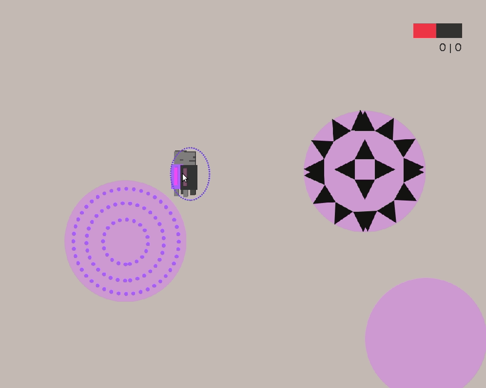

# The Dream Survivor
Projet de jeu pour le cours INFO2056 de ULiège

### Comment jouer ?

#### Touches
*Clic gauche* Pour se déplacer
*Clic droit* Attaquer
*Espace* Bouclier

#### Score
En haut à droit vous avez une gauge de vie.
En dessous, votre **level** et le **nombre de mort**

#### Décors
Vous trouverez comment fonctionne les décors tout seul.

## Auteurs :
Jakub Duchateau && Raul Talmacel